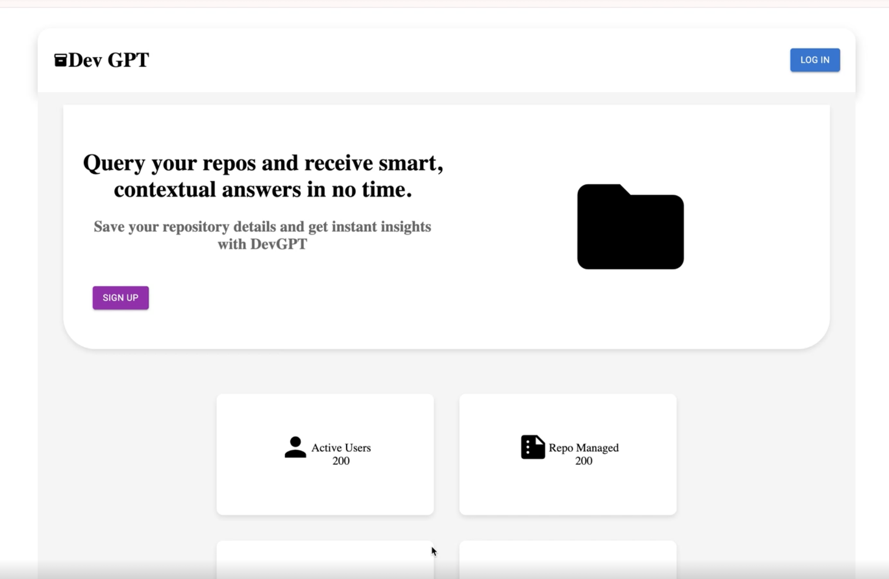

# RAG using AWS Aurora, Langchain and Llama 3

### Goal

Point to the location of the datasource - codebase, pdf, etc. and ask questions about it.

### Index

1. Sign-in Page
2. Landing Page
3. Chat Bot

> Note - 
This project was built during a hackahton. Therefore, it is not production ready. 
You can use it for reference and build your own production ready solution.
> 

---

## Sign-in Page

- Mandatory user sign-In for user tracking

---

## Landing Page

- **Repository Details** - holds access to all information about your current data source and RAG status.
    - Repo Name and branch - tells the **name and branch of repository** that is being given as **context to the LLM**.
    - Actions -
        - Open Chat Bot - Link to open chat-bot.
        - Re-Sync - When data is changed at the source, a user can **re-sync** and **provide fresh context to LLM**.
        - Delete - **Delete** the **existing chat-bot** to free memory.

- **Open Form** Button -
    - Use it to give location to the new datasource for chat-bot to train on.
    

---

## Chat Bot

Directly chat with your datasource - 

[Chat Demo](misc_holder/chat_demo_gif.gif)

---
